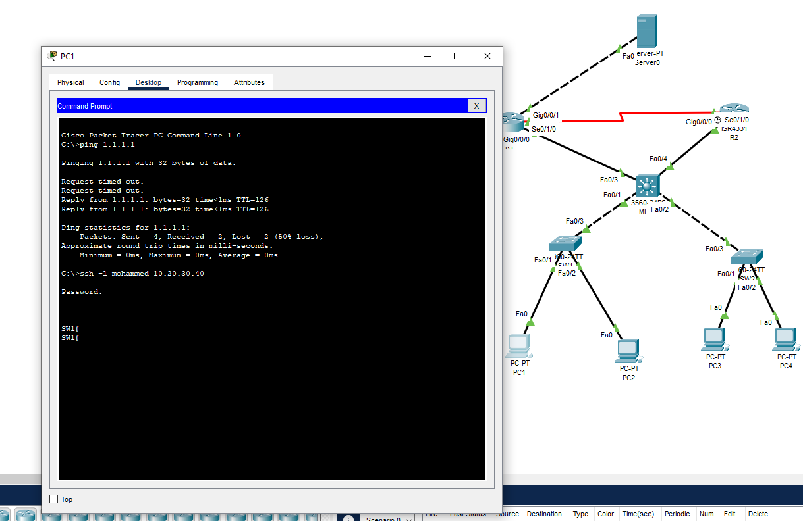

# 🌐 Advanced Networking Project

This project simulates an enterprise-level network topology using **Cisco Packet Tracer**.  
It includes **Switching, Routing, NAT, PAT, ACL, OSPF, DHCP, NTP, and SSH** configuration.  

---

## 🔑 Features
- ✅ Dynamic Routing (OSPF)
- ✅ Secure Remote Access (SSH)
- ✅ NAT & PAT for Internet Access
- ✅ ACL for Traffic Filtering
- ✅ DHCP for Automatic IP Assignment
- ✅ NTP for Time Synchronization
- ✅ VLANs & Inter-VLAN Routing (SVI + Router-on-a-Stick)

---

## 🖼️ Network Topology

---

## 📋 IP Addressing Table

| Device | Interface              | IP Address     | Netmask / CIDR | Notes                              |
|--------|------------------------|----------------|----------------|-----------------------------------|
| **SW1 (MLS1)** | FastEthernet0/4      | 172.16.0.1     | /30            | Link to R1                        |
| SW1    | Loopback0              | 9.9.9.9        | /32            | Test / ID                         |
| SW1    | Loopback1              | 10.20.30.40    | /32            | Test / ID                         |
| SW1    | Vlan1                  | 192.16.1.20    | /24            | SVI (Gateway for PCs)             |
| **R2** | GigabitEthernet0/0/0   | 172.16.0.9     | /30            | Link to MLS1                      |
| R2     | Serial0/1/0            | 172.16.0.6     | /30            | Link to R1                        |
| **R1** | GigabitEthernet0/0/0   | 172.16.0.2     | /30            | Link to SW1                       |
| R1     | GigabitEthernet0/0/1   | 1.1.1.2        | /30            | Link to ISP/Outside               |
| R1     | Serial0/1/0            | 172.16.0.5     | /30            | Link to R2                        |
| R1     | Serial0/1/1            | 10.0.0.1       | /30            | Link to R3                        |
| R1     | Loopback1              | 8.8.8.8        | /32            | Test / DNS                        |
| **R3** | G0/0/0.10              | 192.168.10.1   | /24            | Subinterface (VLAN10)             |
| R3     | G0/0/0.20              | 192.168.20.1   | /24            | Subinterface (VLAN20)             |
| R3     | G0/0/0.30              | 192.168.30.1   | /24            | Subinterface (VLAN30)             |
| R3     | G0/0/0.40              | 192.168.40.1   | /24            | Subinterface (VLAN40)             |
| R3     | Serial0/1/0            | 10.0.0.3       | /30            | Link to R1                        |
| **Laptop1** | FastEthernet0        | 192.168.10.2   | /24            | GW 192.168.10.1 / DNS 8.8.8.8     |
| **Laptop2** | FastEthernet0        | 192.168.20.2   | /24            | GW 192.168.20.1 / DNS 8.8.8.8     |
| **Laptop3** | FastEthernet0        | 192.168.30.2   | /24            | GW 192.168.30.1 / DNS 8.8.8.8     |
| **Laptop4** | FastEthernet0        | 192.168.40.2   | /24            | GW 192.168.40.1 / DNS 8.8.8.8     |
| **PC1** | FastEthernet0          | 172.16.1.1     | /24            | GW 172.16.1.20 / DNS 8.8.8.8      |
| **PC2** | FastEthernet0          | 172.16.1.2     | /24            | GW 172.16.1.20 / DNS 8.8.8.8      |
| **PC3** | FastEthernet0          | 172.16.1.3     | /24            | GW 172.16.1.20 / DNS 8.8.8.8      |
| **PC4** | FastEthernet0          | 172.16.1.4     | /24            | GW 172.16.1.20 / DNS 8.8.8.8      |

---

## ⚙️ Protocols & Verification

### 🔐 SSH
Remote login to devices using SSH.  

---

### 🌍 NAT & PAT
NAT and PAT configured on R1 to allow inside hosts to access the internet.  

---

### 🛡️ ACL
ACL applied on R1 to filter traffic based on source/destination.  

---

### 📡 OSPF
OSPF dynamic routing established between R1, R2, and R3.  

---

### ⏰ NTP
Devices synchronized with NTP server.  

---

### 🖥️ DHCP
DHCP server handing out IP addresses to VLAN clients.  

---

### 🔀 Inter-VLAN Routing
This project demonstrates **two methods of Inter-VLAN Routing**:

1. **Router-on-a-Stick (R3)**  
   - Subinterfaces: G0/0/0.10 → VLAN10, G0/0/0.20 → VLAN20, etc.  

2. **SVI on MLS1**  
   - VLAN1 SVI: 192.16.1.20/24 as Gateway for PCs.  

---

## 🚀 How to Run
1. Download the `.pkt` file.  
2. Open with **Cisco Packet Tracer**.  
3. Verify connectivity using `ping` and `show` commands.  

---

## 🔗 Author
👤 **Mohammed Waled**  
📧 [3kr2001@gmail.com](mailto:3kr2001@gmail.com)  
🌐 [GitHub](https://github.com/Mhmdghost)
